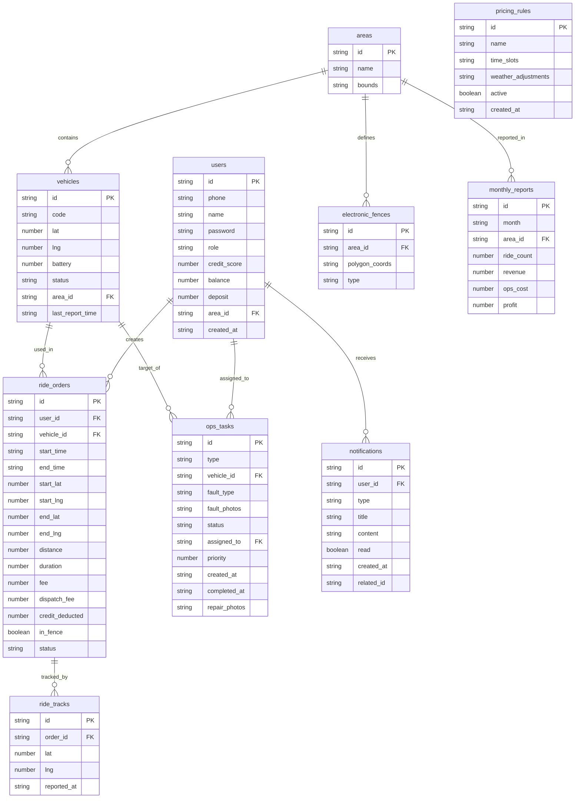

## 1. 架构设计

```mermaid
graph TB
    subgraph "前端层"
        "React SPA" --> "React Router"
        "React Router" --> "用户端页面"
        "React Router" --> "运维端页面"
        "React Router" --> "主管端页面"
        "React Router" --> "管理员端页面"
    end

    subgraph "后端层"
        "Express API Server" --> "认证中间件"
        "Express API Server" --> "路由控制器"
        "路由控制器" --> "业务服务层"
        "业务服务层" --> "数据访问层"
    end

    subgraph "数据层"
        "SQLite 数据库" --> "用户表"
        "SQLite 数据库" --> "车辆表"
        "SQLite 数据库" --> "骑行订单表"
        "SQLite 数据库" --> "运维任务表"
        "SQLite 数据库" --> "计价规则表"
        "SQLite 数据库" --> "消息通知表"
    end

    subgraph "模拟服务"
        "地图数据模拟"
        "天气数据模拟"
        "定位数据模拟"
    end

    "前端层" --> "后端层"
    "后端层" --> "数据层"
    "后端层" --> "模拟服务"
```

## 2. 技术说明

- **前端**：React@18 + TypeScript + Tailwind CSS@3 + Vite
- **状态管理**：Zustand
- **图表库**：Recharts（热力图/折线图/柱状图/饼图）
- **地图**：Leaflet + React-Leaflet（开源地图方案，无需API Key）
- **初始化工具**：vite-init
- **后端**：Express@4 + TypeScript (ESM)
- **数据库**：SQLite (better-sqlite3)
- **认证**：JWT Token
- **图标**：lucide-react

## 3. 路由定义

| 路由 | 用途 | 权限 |
|------|------|------|
| `/login` | 登录页面 | 公开 |
| `/user` | 用户首页-地图找车 | 用户 |
| `/user/riding` | 骑行中页面 | 用户 |
| `/user/history` | 骑行记录 | 用户 |
| `/user/report` | 故障举报 | 用户 |
| `/user/profile` | 用户中心 | 用户 |
| `/ops` | 运维工作台-任务列表 | 运维人员 |
| `/ops/route` | 换电路线 | 运维人员 |
| `/ops/scan` | 扫码确认 | 运维人员 |
| `/supervisor` | 区域主管大屏 | 区域主管 |
| `/supervisor/dispatch` | 调度管理 | 区域主管 |
| `/admin` | 管理员后台首页 | 管理员 |
| `/admin/pricing` | 计价规则管理 | 管理员 |
| `/admin/weather` | 天气调价配置 | 管理员 |
| `/admin/reports` | 运营报告 | 管理员 |
| `/admin/users` | 用户管理 | 管理员 |
| `/notifications` | 消息中心 | 所有角色 |

## 4. API 定义

### 4.1 认证相关

```typescript
interface LoginRequest {
  phone?: string;
  code?: string;
  username?: string;
  password?: string;
  role: 'user' | 'ops' | 'supervisor' | 'admin';
}

interface LoginResponse {
  token: string;
  user: {
    id: string;
    name: string;
    role: string;
    creditScore?: number;
  };
}
```

### 4.2 车辆相关

```typescript
interface Vehicle {
  id: string;
  code: string;
  lat: number;
  lng: number;
  battery: number;
  status: 'available' | 'riding' | 'maintenance' | 'low_battery' | 'fault';
  areaId: string;
  lastReportTime: string;
}

interface NearbyVehiclesRequest {
  lat: number;
  lng: number;
  radius: number;
}

interface NearbyVehiclesResponse {
  vehicles: Vehicle[];
  recommended: Vehicle;
}
```

### 4.3 骑行订单

```typescript
interface RideOrder {
  id: string;
  userId: string;
  vehicleId: string;
  startTime: string;
  endTime?: string;
  startLat: number;
  startLng: number;
  endLat?: number;
  endLng?: number;
  distance: number;
  duration: number;
  fee: number;
  dispatchFee: number;
  creditDeducted: number;
  inFence: boolean;
  status: 'riding' | 'completed' | 'charging';
}

interface UnlockRequest {
  vehicleId: string;
  userId: string;
  paidDeposit?: boolean;
}

interface ReturnRequest {
  orderId: string;
  lat: number;
  lng: number;
}
```

### 4.4 运维任务

```typescript
interface OpsTask {
  id: string;
  type: 'battery_swap' | 'repair' | 'dispatch';
  vehicleId: string;
  vehicleCode: string;
  vehicleLat: number;
  vehicleLng: number;
  battery?: number;
  faultType?: string;
  faultPhotos?: string[];
  status: 'pending' | 'in_progress' | 'completed';
  assignedTo: string;
  priority: number;
  createdAt: string;
  completedAt?: string;
  repairPhotos?: string[];
}

interface OpsRoute {
  taskId: string;
  waypoints: {
    vehicleId: string;
    lat: number;
    lng: number;
    order: number;
    battery?: number;
  }[];
  totalDistance: number;
  estimatedTime: number;
}
```

### 4.5 区域统计

```typescript
interface AreaStats {
  areaId: string;
  areaName: string;
  vehicleCount: number;
  availableCount: number;
  turnoverRate: number;
  faultRate: number;
  rideCount: number;
  revenue: number;
  opsCost: number;
}

interface HeatmapData {
  lat: number;
  lng: number;
  intensity: number;
  type: 'vehicle_density' | 'turnover' | 'fault';
}
```

### 4.6 计价规则

```typescript
interface PricingRule {
  id: string;
  name: string;
  timeSlots: {
    start: string;
    end: string;
    basePrice: number;
    timeRate: number;
    distanceRate: number;
  }[];
  weatherAdjustment?: {
    condition: string;
    multiplier: number;
  }[];
  active: boolean;
}

interface MonthlyReport {
  month: string;
  areas: {
    areaId: string;
    areaName: string;
    rideCount: number;
    revenue: number;
    opsCost: number;
    profit: number;
  }[];
  totalRides: number;
  totalRevenue: number;
  totalOpsCost: number;
  totalProfit: number;
}
```

### 4.7 消息通知

```typescript
interface Notification {
  id: string;
  userId: string;
  type: 'unlock' | 'return' | 'fault' | 'dispatch' | 'system';
  title: string;
  content: string;
  read: boolean;
  createdAt: string;
  relatedId?: string;
  voucherUrl?: string;
}
```

## 5. 服务端架构图

```mermaid
graph LR
    subgraph "Controller层"
        "AuthController"
        "VehicleController"
        "RideController"
        "OpsController"
        "StatsController"
        "PricingController"
        "NotificationController"
    end

    subgraph "Service层"
        "AuthService"
        "VehicleService"
        "RideService"
        "OpsService"
        "StatsService"
        "PricingService"
        "NotificationService"
    end

    subgraph "Repository层"
        "UserRepo"
        "VehicleRepo"
        "RideRepo"
        "OpsTaskRepo"
        "PricingRepo"
        "NotificationRepo"
        "AreaRepo"
    end

    "AuthController" --> "AuthService"
    "VehicleController" --> "VehicleService"
    "RideController" --> "RideService"
    "OpsController" --> "OpsService"
    "StatsController" --> "StatsService"
    "PricingController" --> "PricingService"
    "NotificationController" --> "NotificationService"

    "AuthService" --> "UserRepo"
    "VehicleService" --> "VehicleRepo"
    "RideService" --> "RideRepo"
    "RideService" --> "VehicleRepo"
    "RideService" --> "PricingRepo"
    "OpsService" --> "OpsTaskRepo"
    "OpsService" --> "VehicleRepo"
    "StatsService" --> "AreaRepo"
    "StatsService" --> "RideRepo"
    "PricingService" --> "PricingRepo"
    "NotificationService" --> "NotificationRepo"
```

## 6. 数据模型

### 6.1 数据模型定义



### 6.2 数据定义语言

```sql
CREATE TABLE areas (
  id TEXT PRIMARY KEY,
  name TEXT NOT NULL,
  bounds TEXT NOT NULL
);

CREATE TABLE electronic_fences (
  id TEXT PRIMARY KEY,
  area_id TEXT NOT NULL REFERENCES areas(id),
  polygon_coords TEXT NOT NULL,
  type TEXT NOT NULL DEFAULT 'parking'
);

CREATE TABLE users (
  id TEXT PRIMARY KEY,
  phone TEXT UNIQUE,
  name TEXT NOT NULL,
  password TEXT,
  role TEXT NOT NULL CHECK(role IN ('user', 'ops', 'supervisor', 'admin')),
  credit_score INTEGER DEFAULT 100,
  balance REAL DEFAULT 0,
  deposit REAL DEFAULT 0,
  area_id TEXT REFERENCES areas(id),
  created_at TEXT DEFAULT (datetime('now'))
);

CREATE TABLE vehicles (
  id TEXT PRIMARY KEY,
  code TEXT UNIQUE NOT NULL,
  lat REAL NOT NULL,
  lng REAL NOT NULL,
  battery INTEGER NOT NULL DEFAULT 100,
  status TEXT NOT NULL DEFAULT 'available' CHECK(status IN ('available', 'riding', 'maintenance', 'low_battery', 'fault')),
  area_id TEXT REFERENCES areas(id),
  last_report_time TEXT DEFAULT (datetime('now'))
);

CREATE TABLE ride_orders (
  id TEXT PRIMARY KEY,
  user_id TEXT NOT NULL REFERENCES users(id),
  vehicle_id TEXT NOT NULL REFERENCES vehicles(id),
  start_time TEXT NOT NULL DEFAULT (datetime('now')),
  end_time TEXT,
  start_lat REAL NOT NULL,
  start_lng REAL NOT NULL,
  end_lat REAL,
  end_lng REAL,
  distance REAL DEFAULT 0,
  duration INTEGER DEFAULT 0,
  fee REAL DEFAULT 0,
  dispatch_fee REAL DEFAULT 0,
  credit_deducted INTEGER DEFAULT 0,
  in_fence INTEGER DEFAULT 1,
  status TEXT NOT NULL DEFAULT 'riding' CHECK(status IN ('riding', 'completed', 'charging'))
);

CREATE TABLE ride_tracks (
  id TEXT PRIMARY KEY,
  order_id TEXT NOT NULL REFERENCES ride_orders(id),
  lat REAL NOT NULL,
  lng REAL NOT NULL,
  reported_at TEXT DEFAULT (datetime('now'))
);

CREATE TABLE ops_tasks (
  id TEXT PRIMARY KEY,
  type TEXT NOT NULL CHECK(type IN ('battery_swap', 'repair', 'dispatch')),
  vehicle_id TEXT NOT NULL REFERENCES vehicles(id),
  fault_type TEXT,
  fault_photos TEXT,
  status TEXT NOT NULL DEFAULT 'pending' CHECK(status IN ('pending', 'in_progress', 'completed')),
  assigned_to TEXT REFERENCES users(id),
  priority INTEGER DEFAULT 0,
  created_at TEXT DEFAULT (datetime('now')),
  completed_at TEXT,
  repair_photos TEXT
);

CREATE TABLE pricing_rules (
  id TEXT PRIMARY KEY,
  name TEXT NOT NULL,
  time_slots TEXT NOT NULL,
  weather_adjustments TEXT,
  active INTEGER DEFAULT 1,
  created_at TEXT DEFAULT (datetime('now'))
);

CREATE TABLE notifications (
  id TEXT PRIMARY KEY,
  user_id TEXT NOT NULL REFERENCES users(id),
  type TEXT NOT NULL CHECK(type IN ('unlock', 'return', 'fault', 'dispatch', 'system')),
  title TEXT NOT NULL,
  content TEXT NOT NULL,
  read INTEGER DEFAULT 0,
  created_at TEXT DEFAULT (datetime('now')),
  related_id TEXT
);

CREATE TABLE monthly_reports (
  id TEXT PRIMARY KEY,
  month TEXT NOT NULL,
  area_id TEXT NOT NULL REFERENCES areas(id),
  ride_count INTEGER DEFAULT 0,
  revenue REAL DEFAULT 0,
  ops_cost REAL DEFAULT 0,
  profit REAL DEFAULT 0
);

CREATE INDEX idx_vehicles_area ON vehicles(area_id);
CREATE INDEX idx_vehicles_status ON vehicles(status);
CREATE INDEX idx_ride_orders_user ON ride_orders(user_id);
CREATE INDEX idx_ride_orders_vehicle ON ride_orders(vehicle_id);
CREATE INDEX idx_ride_tracks_order ON ride_tracks(order_id);
CREATE INDEX idx_ops_tasks_assigned ON ops_tasks(assigned_to);
CREATE INDEX idx_ops_tasks_status ON ops_tasks(status);
CREATE INDEX idx_notifications_user ON notifications(user_id);
CREATE INDEX idx_notifications_read ON notifications(read);
CREATE INDEX idx_monthly_reports_month ON monthly_reports(month);
```
